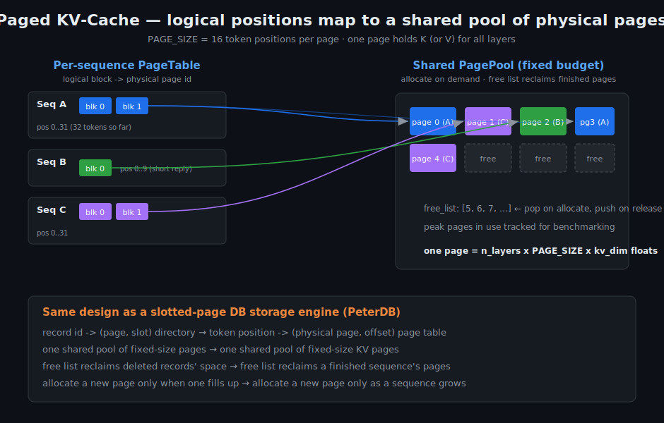
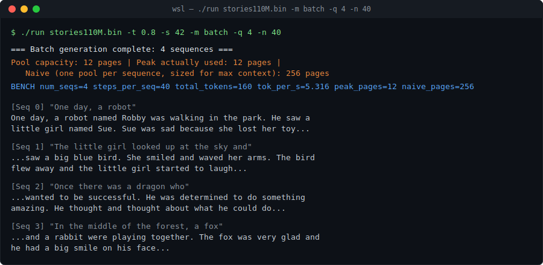
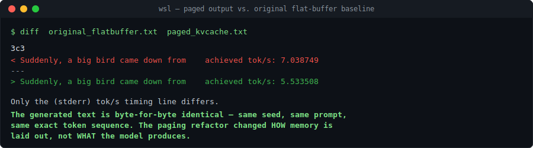
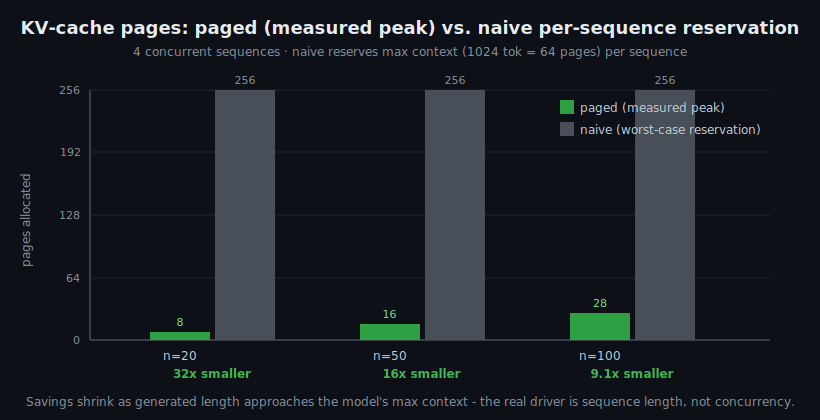

# paged-kv-llama

**A paged KV-cache for LLM inference, built from scratch in C++ by
[Abhiraj Kale](https://github.com/abhiraj-kale) on top of
[karpathy/llama2.c](https://github.com/karpathy/llama2.c).**

This project re-implements the core memory-management idea behind [vLLM's
PagedAttention](https://arxiv.org/abs/2309.06180) — non-contiguous, on-demand,
pooled KV-cache pages — and wires it into a real transformer inference engine.
Multiple conversations run concurrently while sharing a single, fixed memory
budget instead of each reserving worst-case space up front.

The design isn't borrowed from vLLM's code — it's carried over from my previous
from-scratch project, **[PeterDB](https://github.com/abhiraj-kale/cs222p-spring26-abhiraj-kale)**,
a disk-based database storage engine in C++ (slotted pages, a persistent B+-tree
index, an iterator query engine). A paged KV-cache turns out to be the same
data-structure problem as a paged heap file, and building it twice — once for
disk, once for inference — is the whole point of this repo.

> **Attribution / honesty:** the transformer forward pass, tokenizer, and
> sampler are Andrej Karpathy's `llama2.c` (preserved in
> [`README.llama2c.md`](README.llama2c.md)). Everything in
> [`paged_cache.hpp`](paged_cache.hpp)/[`.cpp`](paged_cache.cpp), the C/C++
> interop layer, the multi-sequence scheduler, the benchmarks, and the
> [interactive demo](demo/) is my (Abhiraj Kale's) work. The PagedAttention
> algorithm itself is from the vLLM paper — this is a from-scratch
> re-implementation to understand it, not a novel invention.

> **🎮 Try it live:** the [interactive demo](demo/) races both engines in your
> browser — same prompt, same seed, identical story, with live token streaming
> and a memory meter showing the paged cache growing page by page.
> `docker build -f demo/Dockerfile -t demo . && docker run -p 8000:8000 demo`

---

## The idea in one picture

Every token a model generates must be compared against the Key/Value vectors of
every previous token (attention). Caching those K/V vectors avoids recomputing
them — but the naive cache reserves one giant contiguous buffer *per sequence,
sized for the model's maximum context length*, even for a 10-token reply. On a
server with many concurrent conversations, that wastes enormous amounts of
memory.

The fix is the same one operating systems use for virtual memory, and the same
one a slotted-page database storage engine uses on disk: **chop the cache into
fixed-size pages, hand them out on demand from a shared pool, and use a page
table to map logical token positions to physical pages.**



---

## What it does

Three modes (`-m generate|chat|batch`):

- **`generate`** — original single-sequence text generation, now backed by the
  paged cache. Output is **byte-for-byte identical** to the original flat-buffer
  implementation (verified — see below).
- **`batch`** — runs `-q N` conversations concurrently via a round-robin
  scheduler, all sharing one `PagePool`. Reports measured peak page usage vs.
  what the naive per-sequence approach would have reserved.



---

## Correctness first

Before claiming any memory win, the paged version had to prove it changed *how*
memory is laid out without changing *what* the model produces. Same seed, same
prompt, diffed against the original flat-buffer build:



The paging system is also covered by standalone tests that exercise page reuse
after free, data integrity across a page boundary, isolation between concurrent
sequences, and clean failure on pool exhaustion.

---

## Results



Full data and methodology in [`BENCHMARKS.md`](BENCHMARKS.md). Two findings worth
calling out:

1. **The memory-savings ratio is driven by sequence length relative to max
   context, not by concurrency count.** With 4 sequences, savings fall from 32x
   (20-token replies) to 9.1x (100-token replies) as generated length
   approaches the model's 1024-token max. This is the correct, nuanced picture
   of what PagedAttention actually buys you.

2. **This shares memory, not compute.** Throughput plateaus at ~5 tok/s
   regardless of concurrency, because the scheduler interleaves sequences but
   does *not* batch their matmuls together. A surprising concurrent-vs-sequential
   timing gap was investigated rather than reported at face value: ~16s of a
   ~20s gap was traced to per-process startup overhead, a competing
   "allocation cost" hypothesis was measured and **rejected** (221ms, negligible),
   and the unexplained residual was honestly labeled likely measurement noise.
   Real throughput gains require GPU-batched matmuls — explicitly out of scope.

---

## How it's built

### The core data structures ([`paged_cache.hpp`](paged_cache.hpp))

- **`PagePool`** — owns all physical pages (one flat pool for K, one for V), a
  free list of available page ids, and a peak-usage high-water mark.
  `allocate_page()` pops the free list (returns `-1` when exhausted);
  `free_page()` pushes back.
- **`PageTable`** — per-sequence. Holds a `PagePool*` and an ordered list of the
  physical page ids this sequence owns. `key_ptr(layer, pos)` /
  `value_ptr(layer, pos)` translate a logical position into a real pointer:

  ```
  logical_block   = pos / PAGE_SIZE
  offset_in_block = pos % PAGE_SIZE
  physical_page   = physical_page_ids_[logical_block]   // the indirection
  return pool->key_data(physical_page) + layer*PAGE_SIZE*kv_dim + offset_in_block*kv_dim
  ```

  It allocates pages lazily as a sequence grows, and returns `nullptr` if the
  shared pool is exhausted (callers check).

### The C / C++ boundary ([`paged_cache_c_api.h`](paged_cache_c_api.h))

`run.c` is pure C and cannot parse C++ classes, so the C++ paging code is exposed
through an `extern "C"` API of plain functions over **opaque handles**
(`PagePoolHandle*`, `PageTableHandle*`). `run.c` only ever holds pointers and
passes them back — it never sees the class definitions. This is the standard
pattern for embedding C++ in a C codebase.

### Integration ([`run.c`](run.c))

The transformer math is untouched. Only three cache touchpoints in `forward()`
changed — the K/V write, the K read, and the V read — each swapping flat pointer
arithmetic for a `pagetable_*_ptr()` call. `forward()` now takes an explicit
`RunState*` so multiple sequences can each drive it with their own cache.

### Design lineage — [PeterDB](https://github.com/abhiraj-kale/cs222p-spring26-abhiraj-kale), my storage engine

Before this project I built **PeterDB**, a disk-based relational storage engine
in C++, also from scratch: paged heap files using slotted pages with
header-based offset directories (O(1) field access, variable-length records), a
relational metadata catalog, a persistent B+-tree index with recursive node
splitting/merging and leaf-level sibling pointers, and an iterator-based query
engine (selection, projection, block-nested-loop / index-nested-loop /
grace-hash joins). The `PagePool`/`PageTable` split here is that same design,
pointed at memory instead of disk:

| PeterDB (on disk) | This project (in memory) |
|---|---|
| record id → (page, slot) directory | token position → (physical page, offset) page table |
| shared pool of fixed-size pages | shared pool of fixed-size KV pages |
| free list reclaims deleted records' space | free list reclaims a finished sequence's pages |
| allocate a new page only when one fills | allocate a new page only as a sequence grows |

Recognizing that a production LLM-serving problem (PagedAttention) is the same
data-structure problem I'd already solved for a database is what motivated this
project in the first place.

---

## Build & run

Requires a C++17 compiler and a C compiler. On Windows, WSL (Ubuntu) is the
smoothest path.

```bash
# get a model checkpoint (~418MB)
wget https://huggingface.co/karpathy/tinyllamas/resolve/main/stories110M.bin

# build: compile the C++ paging module and the C engine, link together
g++ -std=c++17 -O3 -c paged_cache.cpp -o paged_cache.o
gcc -O3 -c run.c -o run.o
g++ run.o paged_cache.o -lm -o run

# single-sequence generation (paged cache under the hood)
./run stories110M.bin -t 0.8 -n 100 -i "One day, a robot"

# 4 concurrent sequences sharing one pool
./run stories110M.bin -t 0.8 -m batch -q 4 -n 50
```

A `CMakeLists.txt` is included for IDE use (developed in CLion with a WSL
toolchain).

---

## Roadmap / honest limitations

- CPU-only, single-threaded — no CUDA kernels yet. Paged attention on GPU is the
  natural next step.
- Shares KV-cache **memory** across sequences, but does not **batch compute** —
  no throughput gain, by design.
- Benchmarks are single-sample (no repeated-trial averaging).
- Fixed `PAGE_SIZE = 16`; no prefix sharing / copy-on-write across sequences yet
  (a real PagedAttention feature).
